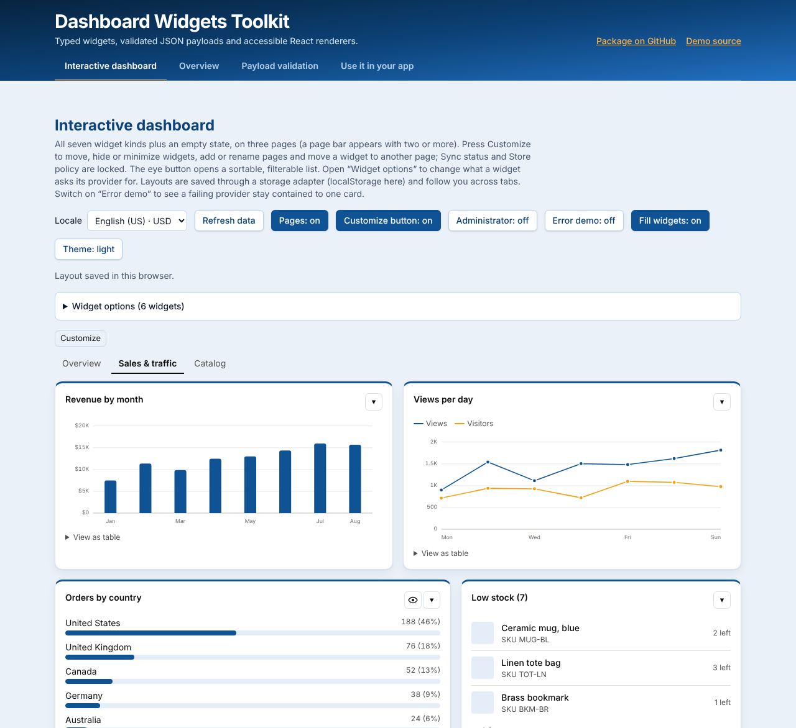

# Dashboard Widgets Toolkit Demo

- Author: Richard McQuiston
- Website: https://richardmcquiston.com/

## Overview

Single Page Application (SPA) demo page demonstrating the features of the dashboard-widgets NPM package.

**Live demo:** https://dashboard-widgets-toolkit-demo.vercel.app/

<p align="center">
  <a href="https://dashboard-widgets-toolkit-demo.vercel.app/">
    <picture>
      <source media="(prefers-color-scheme: dark)" srcset="./docs/screenshot-dark.png" />
      
    </picture>
  </a>
</p>

## Getting Started

### Prerequisites

- Node.js 20+ and npm.

### Installation

```bash
npm install
```

The demo uses the published
[`@richardmcquiston01/dashboard-widgets-toolkit`](https://www.npmjs.com/package/@richardmcquiston01/dashboard-widgets-toolkit)
package (`^0.12.0`).

### Usage

```bash
npm run dev          # local dev server
npm run build        # type-check and build to dist/
npm run preview      # serve the production build
npm run format:check # Prettier
```

### Examples

The demo is a Vite + React + TypeScript + Tailwind CSS single page app with
four tabs (deep-linkable, e.g. `#validation`) under a header that keeps the title and tabs
in view while the description and links fold away as you scroll,
a floating jump-to-top button and a copyright footer:

- **Interactive dashboard** tab: all seven widget kinds plus an empty state,
  loaded with the `useWidgets` hook so each card fills in on its own as its
  data arrives (the demo gives every provider a different fake latency).
  Move, hide and minimize cards (minimized cards wait in a "Minimized:" bar);
  the layout persists in `localStorage` through a storage adapter.
- **Widget widths** on a 12-column grid: each definition sets `width` (for
  example 3 for the KPI tiles, 6 for charts, 8 for the products table).
- **Detail view**: the eye button on "Most popular products", "Orders by
  country" and "Recent orders" opens a dialog with search, column filters,
  sortable headers and paging. The demo's `loadDetail` returns the full rows;
  a real app would query its database there.
- **Table controls**: "Most popular products" and "Recent orders" set
  `tableControls: true`, giving the card itself a search box and sortable
  headers over the rows it shows (the eye button opens the full list).
- **Error demo** toggle (off by default): adds a clearly labelled widget whose
  provider intentionally throws, showing that one failure stays on its own
  card (with a Retry button) while the rest of the dashboard keeps working.
- **Settings** (gear button): a modal with the light / dark mode, the color theme
  picker and the locale switcher.
- **Locale switcher** (in Settings): formats numbers and currency per locale. Providers
  receive the locale and currency in their context and set `currency` on
  `KPI` and `GRAPH` payloads (the toolkit defaults to USD otherwise).
- **Fill widgets** toggle: every widget definition in
  [`src/data/widgets.ts`](./src/data/widgets.ts) sets the toolkit's per-widget
  `fill: 'both'`, so cards stretch to their row's height and take the columns
  left over in their row. The toggle drops `fill` from the definitions to show
  the default layout (cards only as big as their content).
- **Light / dark mode** (in Settings; blue brand palette via `--dwt-*` custom properties)
  and a **Refresh** that re-runs the providers.
- **Color theme picker** (Settings): presets and a custom accent, each built
  with the toolkit's `createTheme` and scoped with a `data-dwt-theme` attribute.
- **Customize / Done edit mode**: the Arrange icon on each card (a menu with
  Move earlier, Move later, Move to page and Hide) shows only after pressing
  Customize, with Reset layout and Revert changes in the toolbar. A
  toggle returns to the always-on controls.
- **Locked widgets**: "Sync status" is pinned (it can still be hidden or
  minimized) and "Store policy" cannot be moved, hidden or minimized. The
  "Administrator" toggle passes `overrideLocks`.
- **Pages**: three pages with a page bar (shown for two or more pages). While
  customizing, add, rename, move and delete pages, and move a widget to another
  page; the "Pages" toggle switches to a single page.
- **Declared options and the Options dialog**: six widgets declare options with
  defaults (rows shown, months, period, a text filter, columns, sort). Press
  Customize, open a card's Arrange icon and choose **Options…** to change its
  title, width (Most popular products and Recent orders can't go below half the
  row; the KPI tiles can't go above half), whether it grows to fill its row, and
  its declared options. Apply, Discard, Reset to defaults and Revert to before
  editing each ask first. The choices are saved in the layout (localStorage), and
  only the widgets whose values changed reload. Store policy is locked against
  options until you switch on Administrator.
- **Alternate views and clones**: Most popular products and Recent orders
  declare `views` (bars, a chart), chosen in the Options dialog's **View**
  field. **Duplicate** in the Arrange menu makes a clone with its own view,
  width, title and options, loaded through the original's provider; **Delete
  this widget** in the clone's dialog removes it. Store policy can't be
  duplicated, and a page with no room disables Duplicate.
- **Storage adapters**: the layout is saved with `useStoredLayout` over a
  `localStorage` adapter ([`src/data/localStorageAdapter.ts`](./src/data/localStorageAdapter.ts))
  with an in-memory fallback; changes made in another tab are offered with a
  ✓ / X prompt.
- **Overview** tab: what the toolkit is, its features and widget kinds.
- **Payload validation** tab, a playground: `validateWidgetData` with
  field-level errors.

Widgets and simulated providers live in
[`src/data/widgets.ts`](./src/data/widgets.ts).

## Deployment

Deployed to Vercel (framework preset: Vite, build `npm run build`, output
`dist`; see [`vercel.json`](./vercel.json)). Feature branches merge into `dev`
through pull requests; `dev` merges into `main` after testing.

## Buy Me a Coffee

If this app, code, or repository has helped you or someone you know, please consider donating. I appreciate any help to offset the costs of development and/or AI Credits.

[**Donate via Stripe**](https://donate.stripe.com/00w5kD3Gj1Xo9v7gVOcs800), or scan:

[](https://donate.stripe.com/00w5kD3Gj1Xo9v7gVOcs800)

## License

Apache 2

## Copyright

(c)2026 Richard McQuiston. All rights reserved.
